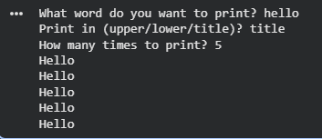

# Automation Scripts

Collection of Python utilities focused on input handling, validation, and simple automation tasks.

## Word Printer Utility

**word-printer.py**  
A command-line tool that safely collects user input for:
- A word (length 1–13)
- Number of repetitions (1–10, max 3 attempts)
- Case style (upper, lower, title)

Prints the formatted word the requested number of times.

### Features Demonstrated
- Robust input validation with retries and error messages
- While loops for repeated prompting
- Function modularization (separation of concerns)
- String manipulation (.upper(), .lower(), .title())
- Basic exception handling (ValueError)
- Main guard (`if __name__ == "__main__":`)

### Example Output


### How to Run
```bash
python word-printer.py
