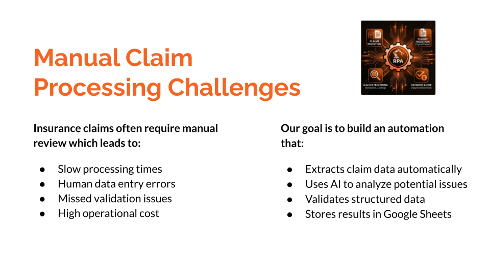
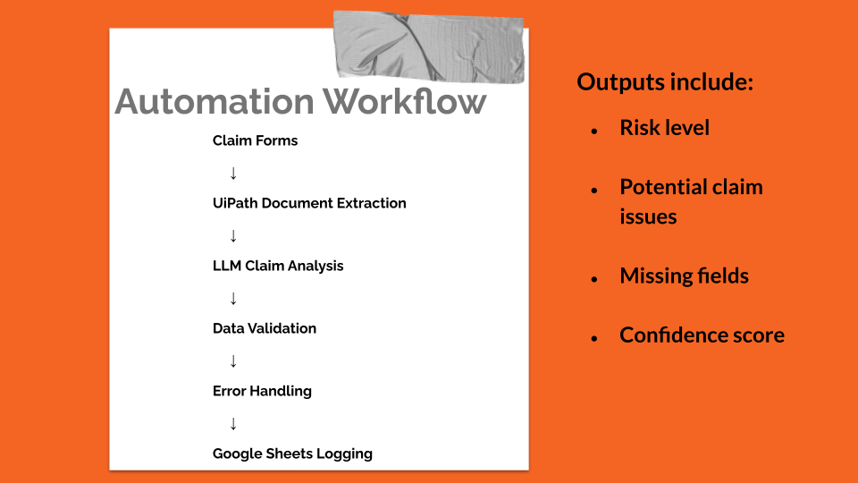
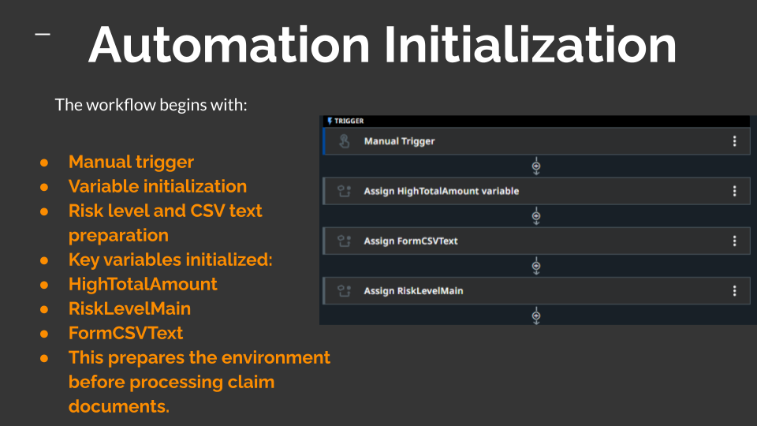
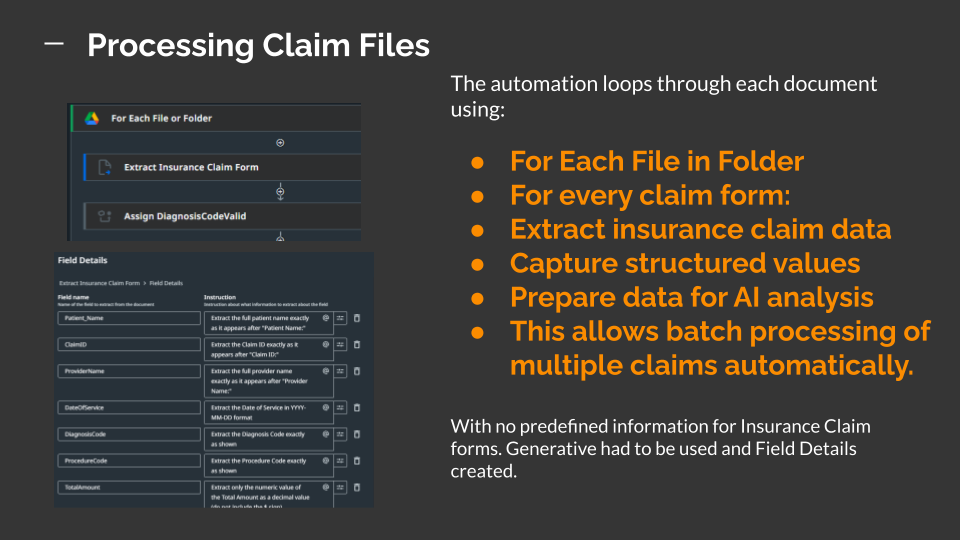
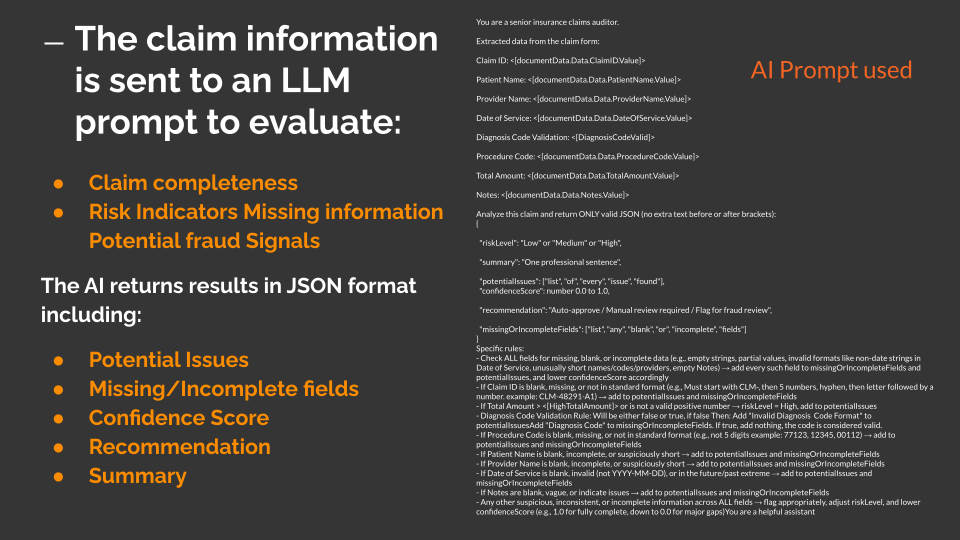
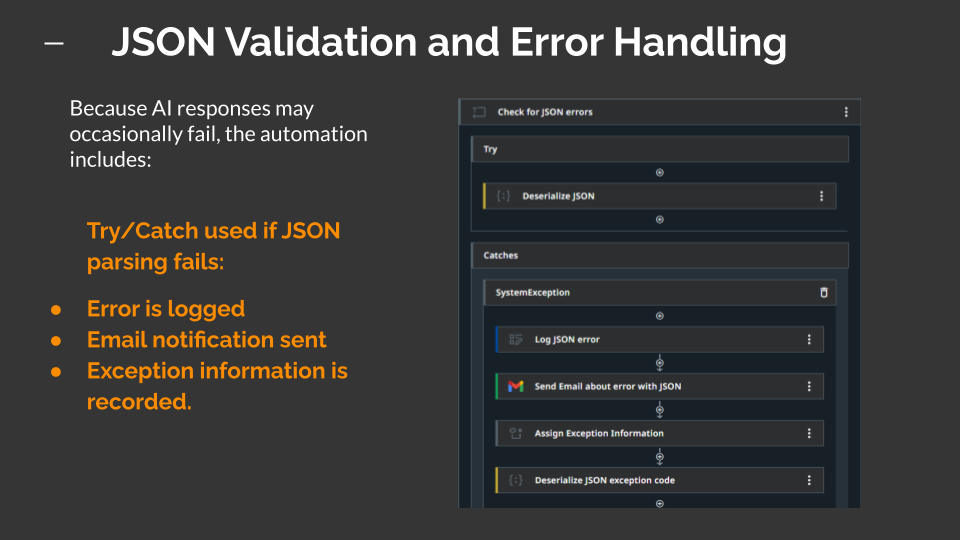
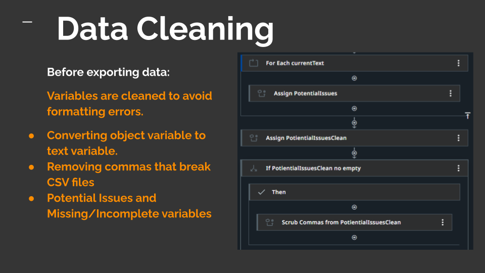
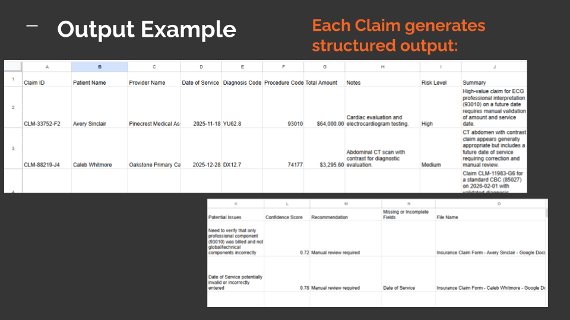
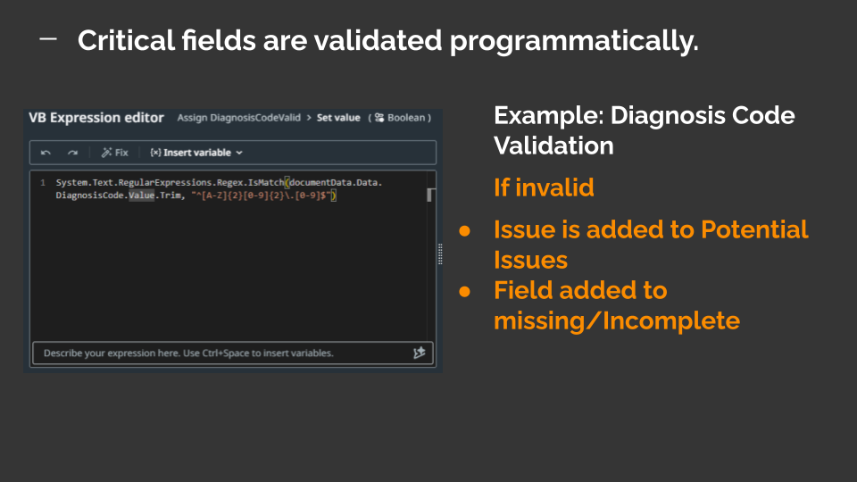
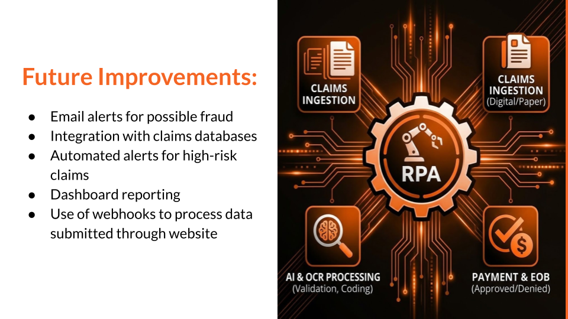

# AI-Powered Insurance Claim Processing Automation

**Sprint 7 Final Project** by Anthony Tipton  
RPA (UiPath) + AI (LLM) automation that extracts, validates, and analyzes insurance claims.

**Privacy & Data Disclaimer**  
This project uses **fully synthetic, AI-generated data** to simulate insurance claim processing. All examples—including claim IDs, patient names, diagnosis codes, totals, and any Google Sheets outputs—are fictional and created via generative AI prompts. **No real patient records, identifiable information, or protected health information (PHI) were collected, processed, or involved**. The goal is to demonstrate RPA + AI workflow concepts responsibly while fully respecting privacy standards.

### Problem
Manual claim processing is slow, error-prone, and expensive.

### Solution & Workflow
Automated batch processing using UiPath Document Understanding + custom LLM prompt.

### Key Steps
1. Initialization & variable setup  

2. Loop through claim forms  

3. AI Analysis (LLM Prompt)  

4. Error Handling & JSON Validation  

5. Data Cleaning & Google Sheets Output  
  

### Example Validation

### Benefits
- Faster processing
- Fewer errors
- AI-powered risk & fraud detection
- Scalable for hundreds of claims

### Future Improvements

### Issues & How I Fixed Them
- Write Row glitch → switched to DataTable + Write Range  
- LLM diagnosis validation → handled programmatically  

### Links
- PDF files used: https://drive.google.com/drive/folders/16HjyleCFRGo9hZM9tHw1tvHvxKKA8RqU?usp=drive_link  
- Sample Output Google Sheet: https://docs.google.com/spreadsheets/d/1iq0iYZ-H2KISH396eRveE5dK10SbKhBhRz8pkND4Gf4/edit?usp=drive_link  
- Demo video/slides: https://docs.google.com/presentation/d/1saVZ1QWSkt206eEinsBpcUw1DHK8MgXh8mflEUneZ4c/edit?usp=drive_link
- Insurance form Template: https://docs.google.com/document/d/18ErADxV1WLblgR-X6e1RNgmUgFSaDSiJDDk9L9Vk7Q0/edit?usp=drive_link

