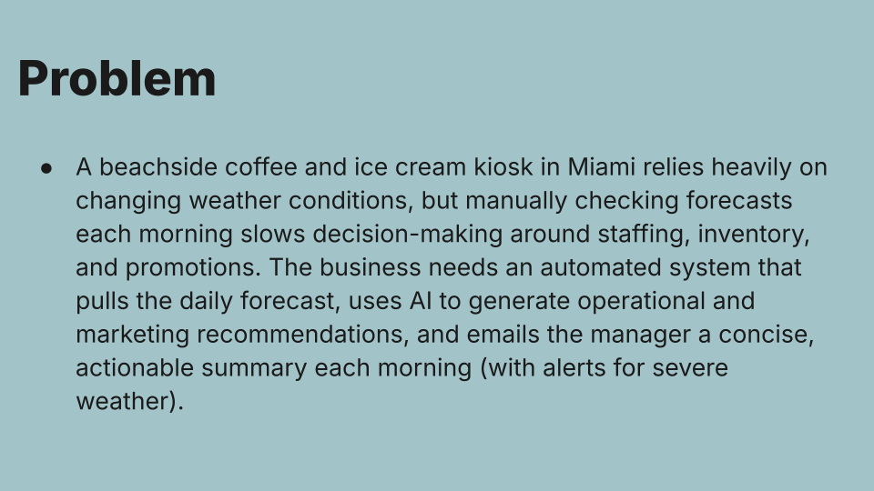
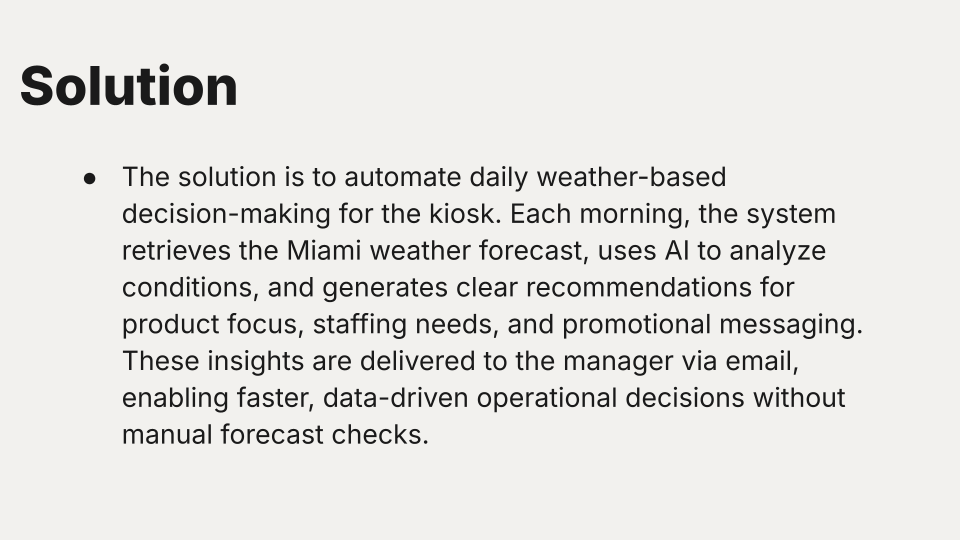
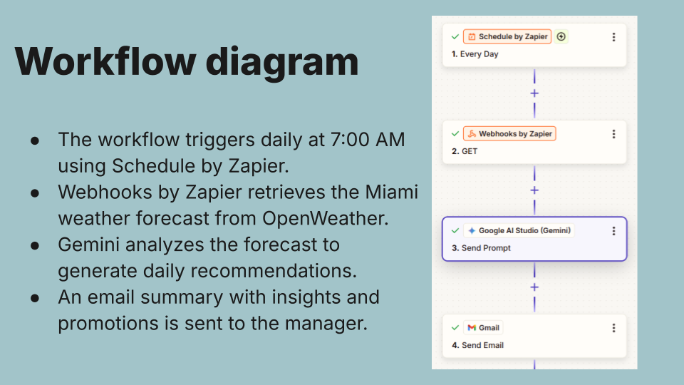
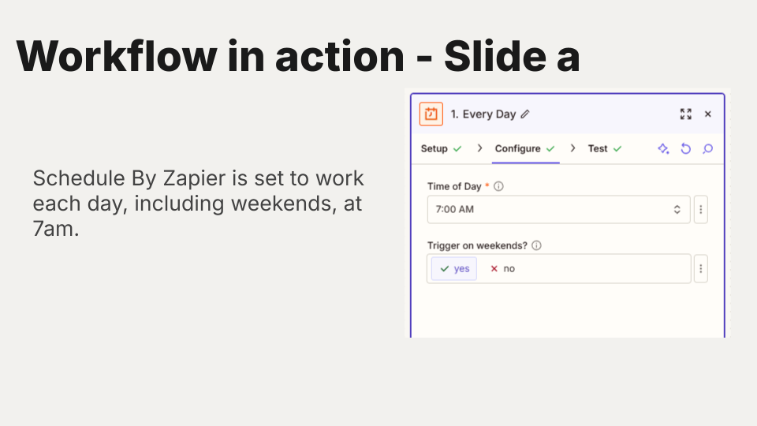
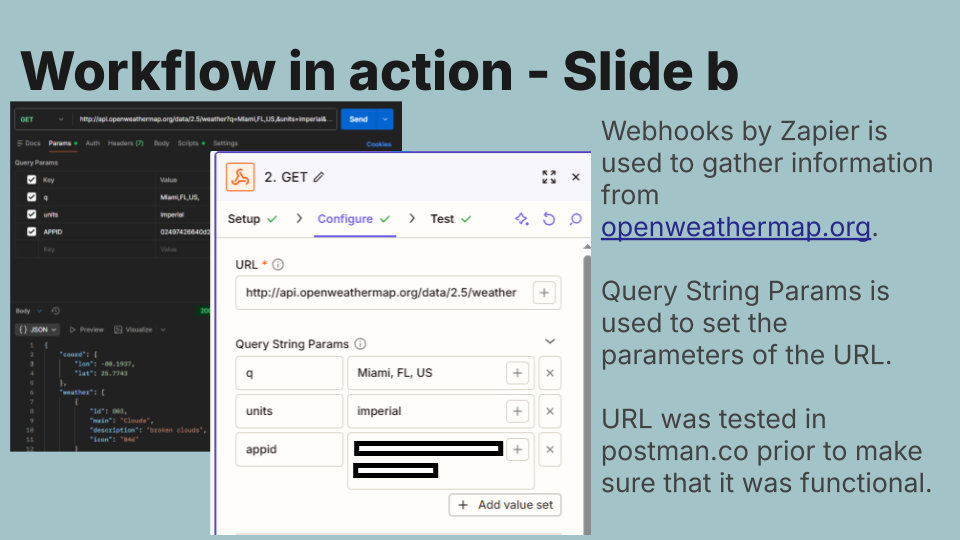
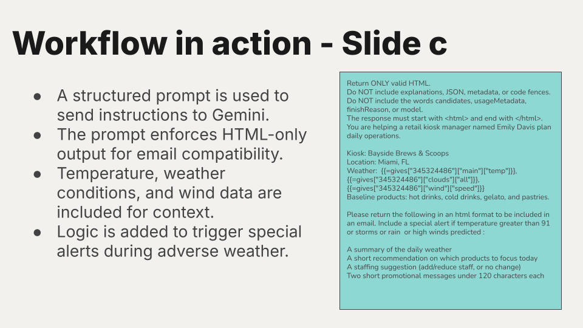
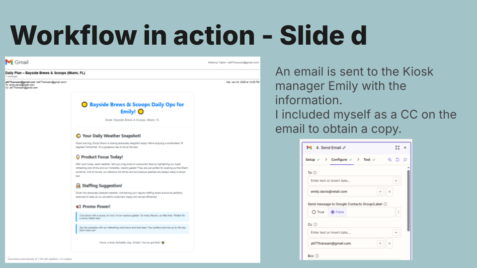
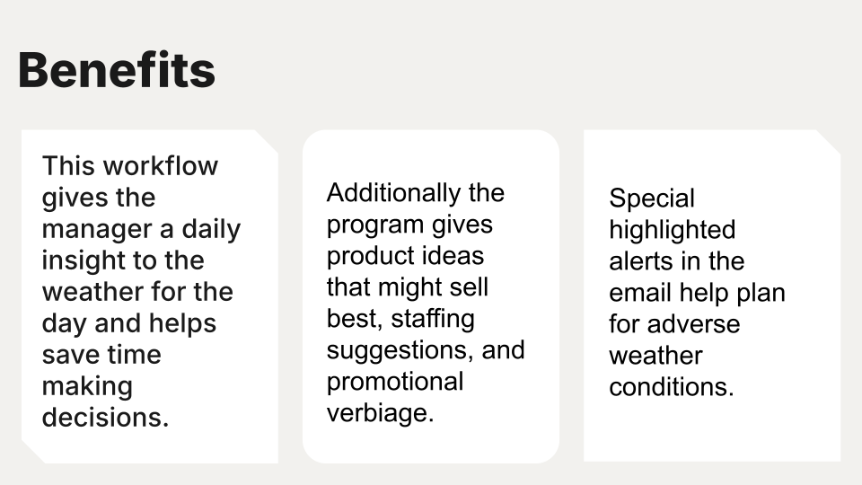
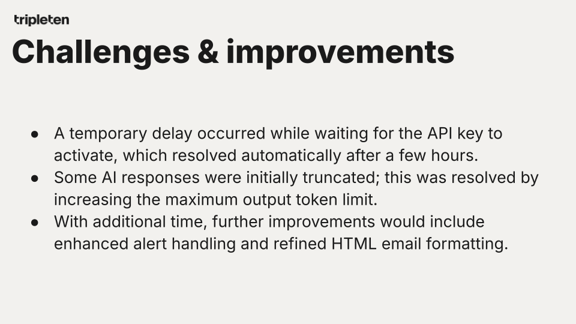

# Weather Decision Engine: AI-Powered Sales & Staffing Automation

**Project 5** by Anthony Tipton  
Automates daily weather-based recommendations for a beachside coffee/ice cream kiosk in Miami using Zapier, OpenWeather API, Gemini AI, and email notifications.

**Important Disclaimer**  
All weather analysis, recommendations, staffing suggestions, promotional messages, and email examples in this project are generated using **synthetic/simulated data and AI prompting** for demonstration purposes only. **No real-time production data, actual business operations, or personal information was used**. This is a proof-of-concept workflow and not intended for live commercial deployment without further validation.

### Problem
Beachside kiosks like Bayside Brews & Scoops suffer from weather-dependent sales. Manual daily forecast checks slow staffing, inventory, and promotion decisions.

### Solution
Daily automated workflow (runs at 7 AM):
- Pulls Miami forecast via OpenWeather API
- Gemini AI analyzes temp, clouds, wind → generates product focus, staffing, promos
- Emails concise, actionable summary to manager (with alerts for heat/storms/rain/high winds)

### Workflow Diagram

### Key Steps in Action
1. **Daily Trigger** – Schedule by Zapier at 7:00 AM  
   

2. **Fetch Forecast** – Webhooks by Zapier + OpenWeather API (tested in Postman)  
   

3. **AI Analysis** – Structured Gemini prompt enforces HTML-only output for email  
   

4. **Email Delivery** – Sends formatted summary + alerts to manager (Emily)  
   

### Benefits
- Saves manager time—no manual checks
- Data-driven product focus (e.g., more gelato on hot days)
- Smart staffing adjustments
- Built-in alerts for adverse weather
- Promotional messaging ready to use

### Challenges & Resolutions
- API key activation delay → Waited a few hours (resolved automatically)
- Initial truncated AI responses → Increased max output tokens

### Technologies Used
- Zapier (Schedule, Webhooks, Email)
- OpenWeather API
- Google Gemini (for intelligent recommendations)
- HTML formatting for clean email delivery

This project shows no-code/low-code automation + AI integration for real-world retail decisions.

---
Made with Zapier + Gemini AI | Ethical synthetic demo | Scalable to other locations/conditions
